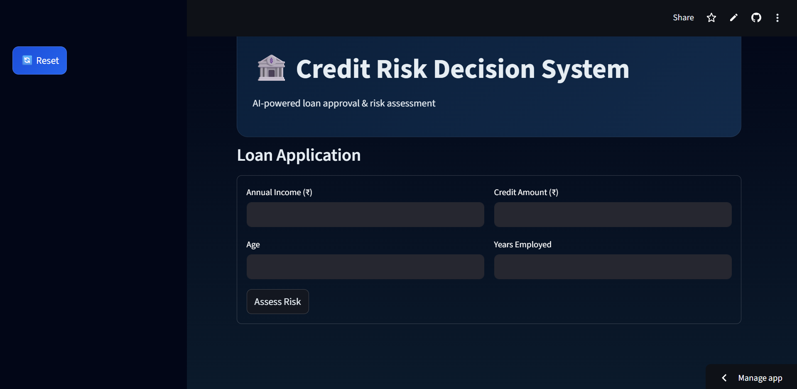
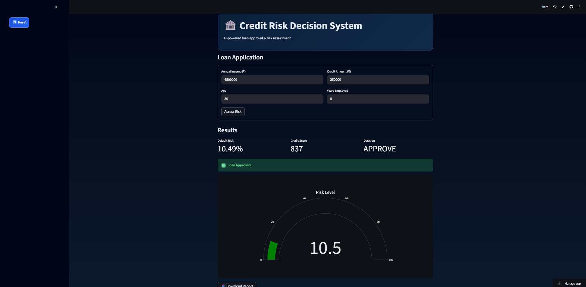

# 🏦 Credit Risk Scoring System

## 🚀 Live Demo

🔗 https://credit-risk-scoring-bysrinath.streamlit.app/

---

## 📌 Project Overview

This project builds an end-to-end **Credit Risk Scoring System** that predicts the probability of loan default and assists in automated loan decision-making.

The system uses Machine Learning to estimate borrower risk and converts it into a **credit score (300–900 scale)** similar to real-world financial systems.

---

## 🎯 Objective

To predict whether a customer is likely to default on a loan and support financial institutions in making **data-driven lending decisions**.

---

## 🧠 Key Features

* 📊 Predicts **Probability of Default (PD)**
* 🔢 Converts risk into **Credit Score (300–900)**
* 🏦 Provides decision:

  * ✅ APPROVE
  * ⚠️ REVIEW (Manual Underwriting)
  * ❌ REJECT
* 📈 Interactive **Streamlit Web App**
* 📥 Downloadable loan assessment report

---

## 🗂 Dataset

* 📌 Home Credit Default Risk Dataset (Kaggle)
* Contains customer financial, demographic, and loan-related features

---

## 🔍 Exploratory Data Analysis (EDA)

Key insights:

* Dataset is **highly imbalanced** (more non-default cases)
* Younger customers show slightly higher default rates
* Shorter employment duration increases risk
* Engineered features like **credit-to-income ratio** are strong predictors
* Raw credit amount alone is not sufficient

---

## ⚙️ Feature Engineering

* Credit-to-Income Ratio
* Income-to-Credit Ratio
* Employment-to-Age Ratio
* External Risk Scores (EXT_SOURCE)

---

## 🤖 Models Used

| Model               | ROC-AUC Score             |
| ------------------- | ------------------------- |
| Logistic Regression | 0.63                      |
| Random Forest       | 0.70                      |
| XGBoost             | **0.74 (Selected Model)** |

👉 XGBoost was selected due to best performance

---

## 🏗️ Tech Stack

* Python
* Pandas, NumPy
* Scikit-learn
* XGBoost
* Streamlit

---

## 🏦 Business Impact

This system helps financial institutions:

* Reduce loan default risk
* Automate credit decision processes
* Identify high-risk customers early
* Improve lending efficiency

---

## 🖥️ Application Features

* Real-time risk prediction
* Credit score generation
* Decision support system
* Explainable AI insights

---

## 📸 Screenshots

### 🔹 Input Page


### 🔹 Results Page

---

## 📂 Project Structure

```
app.py
credit_risk_model.pkl
model_columns.pkl
requirements.txt
notebook.ipynb
```

---

## 📌 Future Improvements

* Integrate real credit bureau data (CIBIL-like scoring)
* Improve model accuracy using advanced techniques
* Add multi-page dashboard (portfolio analytics)
* Deploy using cloud infrastructure (AWS/GCP)

---

## 👨‍💻 Author

**Sai Datta Srinath**

---

